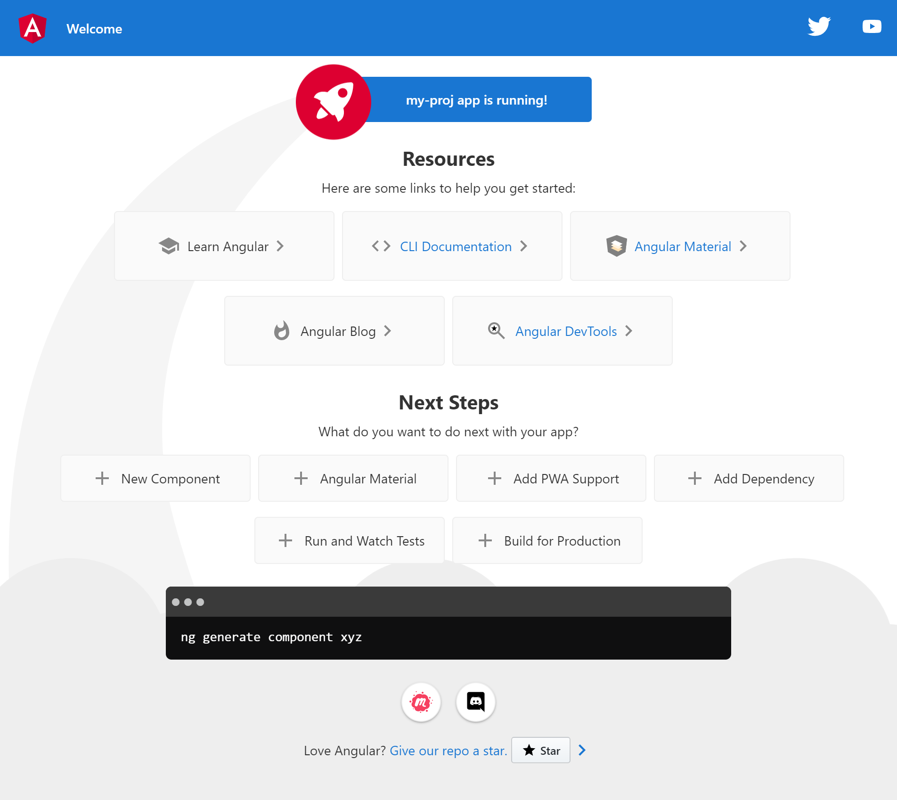
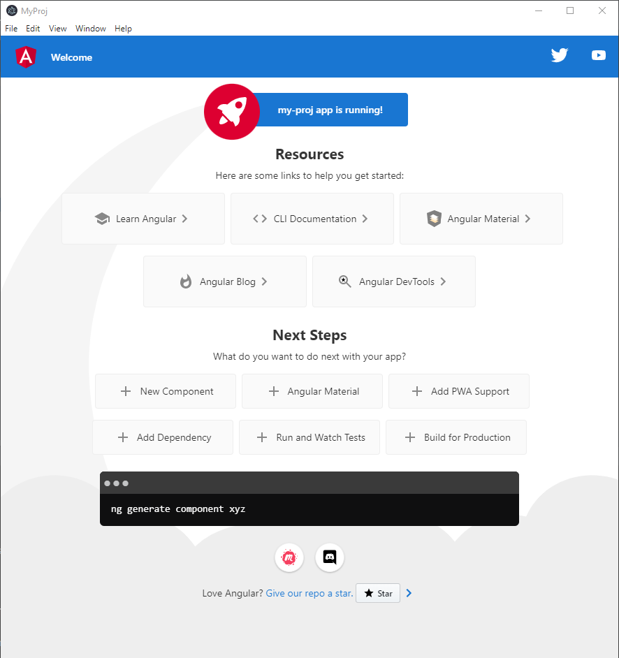

# Environment

| Package name | Version | Site                                                                                                                                                                                    |
|--------------| ------- |-----------------------------------------------------------------------------------------------------------------------------------------------------------------------------------------|
| Node.js      | 16.13.2 | [Node.js](https://nodejs.org/en/)                                                                                                                                                       |
| npm          | 8.4.0   | [npm](https://docs.npmjs.com/downloading-and-installing-node-js-and-npm)                                                                                                                |
| Angular cli  | 13.2.0  | [Angular CLI](https://github.com/angular/angular-cli),  [Angular CLI Overview and Command Reference](https://angular.io/cli), [Karma](https://karma-runner.github.io/latest/index.html) |
| Electron     | 17.0.0  | [Electron]()                                                                                                                                                                            |

# Install

## Install Node.js and npm

Node.js https://nodejs.org/en/

If you want to update npm, type like as follows

``` 
%> npm install -g npm@8.4.0
```

## Install Angular

```
%> npm install -g @angular/cli
```

In some your directory, you can make angular environment as follows

```
%> ng new my-first-project
```

See https://angular.io/cli. You can check the result of installation,

```
%> cd my-first-project
%> ng serve
```

Browse localhost:4200 from your local browser.



Add the following settings into .browserslistrc or update Angular if you get an error ` Invalid version: “15.2-15.3”`.

   ```
   not ios_saf 15.2-15.3
   not safari 15.2-15.3
   ```

## Install Electron

In the directory you have made in the above,

```
%> npm install --save-dev electron
```

## Setting to insert Electron to Angular environment.

1. Insert a script to build & run into a scripts section in package.json

   ```
   "scripts": {
       "electron": "ng build && electron ."
   }
   ```

2. Insert a line `"main" : "main.js"` to package.json.

3. make main.js in the top directory.

   ```
   const {app, BrowserWindow} = require('electron');
   const url = require('url');
   const path = require('path');
   
   function onReady () {
     win = new BrowserWindow({width: 900, height: 950})
     win.loadURL(url.format({
       pathname: path.join(
         __dirname,
         'dist/my-proj/index.html'),
       protocol: 'file:',
       slashes: true
     }))
   }
   
   app.on('ready', onReady);
   ```

4. change` <base href="/">` to `<base href="./">` in src/index.html

## Run

```
%> npm run electron
```

